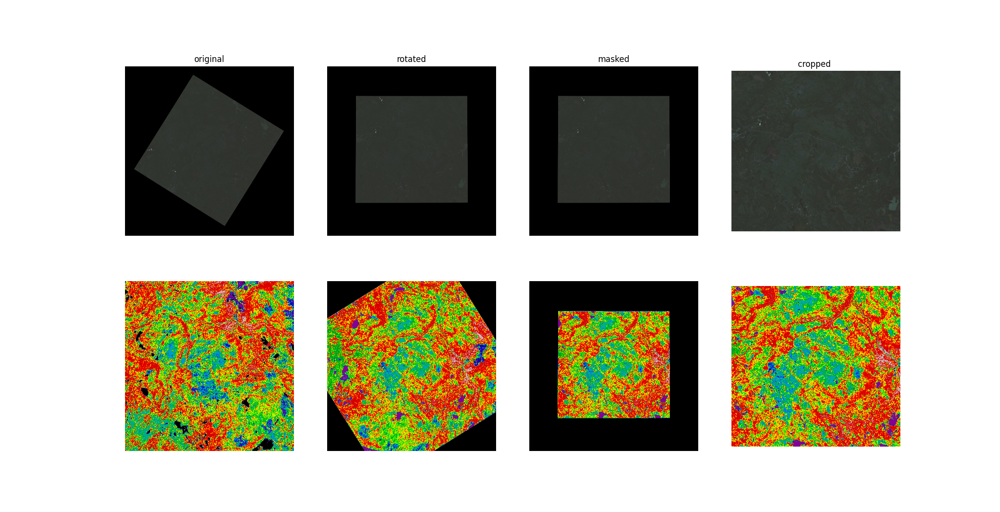

# TB17-landsat ML model for land cover classification 

An Instance Segmentation model to classify different landcover classes using raw satellite imagery.


## Datasets

Input:  of Landsat 8 images Level 2 collection 2 using https://earthexplorer.usgs.gov/ web interface. \
The Multi-spectral Image consists of Blue, Green, Red, NIR, SWIR 1 and SWIR 2 corresponding to bands numbers (2, 3, 4, 5, 6, 7), respectively.


Label: Landcover 2015 from [National Forest Information System](https://www.google.com/url?q=https://opendata.nfis.org/mapserver/nfis-change_eng.html&sa=D&source=editors&ust=1629370818190000&usg=AOvVaw2KuSW6Mkyf05elJAda43O7)
\
The following classes were included in label data:
- no_change
- water 
- snow_ice 
- rock_rubble 
- exposed_barren_land 
- bryoids 
- shrubland 
- wetland 
- wetlandtreed 
- herbs 
- coniferous 
- broadleaf 
- mixedwood 


## Preprocessing

The preparation of the train data consists of extracting pairs of input und output of the train and label data. This requires the datasets to be projected in the same spatial reference. Therefore, the landsat images were reprojected to match the same spatial reference of landcover dataset. After Datasets-registration patches with fixed size were extracted to prepare the train and label data.



## Training
The model has u-net architecture consisting of 5 convolution and deconvolution layers. The model is trained to classify 4 different classes (water, herbs, coniferous and other) using the dice coefficient to evaluate accuracy.
The model has reached total accuracy of 89% after learning for 120 epochs.

## Testing or using the model

After the model loads the weights it can estimate raw bands images of landsat 8 using ```model.estimate_raw_landsat(input_landsat_bands_normalized, visual_light_reflectance_mask, metadata)``` as demonstrated in test.py. \
The raw landsat bands should be in one folder named as their originial _Landsat Product Identifier L2_ followed by the SR\_B<band\_number>.TIF (e.g. LC08\_L2SP\_196024\_20210330\_20210409\_02\_T1\_SR\_B4.TIF is band 4 of the landsat product LC08\_L2SP\_196024\_20210330\_20210409\_02\_T1) 

The result ```classified_landcover.tiff``` is saved as a geo-referenced one-band GeoTiff in the same folder.

## OGC API Processes

A pygeoapi processor is implemented in `api_processes/landcover_prediction.py`.

We recommend using the asynchronous mode because of the runtime of the according prediction jobs.
Hence, the pygeoapi configuration requires two adjustments.
One to add the processor and another one for adding a job manager.
Atm, we are using the provided TinyDB based one.

First, we add the job manager:

```yaml
server:
    manager:
        name: TinyDB
        connection: /tmp/pygeoapi-process-manager.db
        output_dir: /tmp/
```

Use the following section to add the landsat prediction processor:

```yaml
resources:
    landcover-prediction:
        type: process
        processor:
            name: landsatpredictor.LandcoverPredictionProcessor
```

### Testing

You can use the simple default configuration in `tests/config.yml` for local testing.

1. It is recommended to install the latest pygeoapi version in your development venv:

   ```shell
   pip install https://github.com/geopython/pygeoapi/archive/master.zip
   ```

1. Afterwards, install this package as `editable`:

   ```shell
   pip install --editable .
   ```

1. Start a pygeoapi instance using this configuration:

   ```shell
   PYGEOAPI_CONFIG=./tests/config.yml pygeoapi serve
   ```

1. Execute an example prediction:

   ```shell
   curl -X POST "http://localhost:5000/processes/landcover-prediction/execution" \
   -H "Content-Type: application/json" \
   -d "{\"mode\": \"async\", \"inputs\":{\"landsat-collection-id\": \"landsat8_c2_l2\", \"bbox\": \"-111.0,64.99,-110.99,65.0\"}}"
   ```
